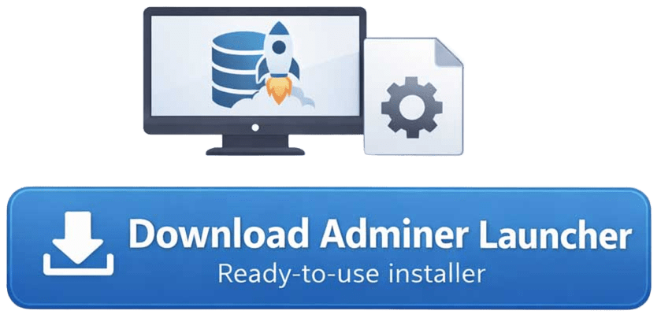

<div align="center">
  <h1>🗄️ Adminer Launcher</h1>
  <p>Lightweight local database manager powered by Adminer + embedded PHP + native desktop interface.</p>
</div>

Adminer Launcher is a standalone Windows application that runs **Adminer locally** using an embedded PHP server and a native desktop window powered by Python + PyWebView.

No XAMPP.\
No Apache configuration.\
No manual setup.

Just run and manage your databases.

------------------------------------------------------------------------

## ✨ Why Adminer Launcher?

Adminer Launcher was built to eliminate the friction of configuring local database environments on Windows.

Stop bundling your database management with language-specific stacks. Whether you are working with Node.js, Python, or Go, this tool offers a stack-agnostic, intuitive interface that simplifies data inspection and management through a clean, high-performance desktop client

------------------------------------------------------------------------

## ✨ Features

- 🖥️ Native desktop interface (PyWebView)
- ⚡ Embedded portable PHP runtime
- 🔐 AES-256-GCM encrypted password storage
- 🗂️ Multi-server support (PostgreSQL, MySQL/MariaDB, SQLite)
- 🤖 Optional Ollama SQL assistant integration
- 🌍 Multi-language system (Portuguese 🇧🇷 / English 🇺🇸)
- 🎨 Custom dark UI
- 📦 Fully standalone `.exe` build
- 🛠️ Adminer plugin support
- 🔄 Auto-restart after configuration changes
- 🧩 login-without-credentials & sql-ollama plugins included

------------------------------------------------------------------------

## 📦 What's Inside

- Adminer 5.4.2
- Portable PHP 8.5.3
- Custom theme
- Secure config system
- Encrypted credential storage
- Installer built with Inno Setup

------------------------------------------------------------------------

## 📥 Download Adminer Launcher

Just want to use Adminer Launcher without building from source?

Download the ready-to-use installer and start managing your databases in seconds:

<div align="center">
<a href="https://github.com/guisaldanha/adminer-launcher/releases/latest">
  
</a>
  <p>Compatible with Windows 10/11 • No PHP or Python installation required • All-in-one package</p>
</div>

If you prefer building or running from source, see the instructions below.

------------------------------------------------------------------------

## 🚀 Development Setup

Clone:

```bash
git clone https://github.com/guisaldanha/adminer-launcher.git
cd adminer-launcher
```

Create virtual environment:

```bash
python -m venv venv
venv\Scripts\activate
pip install -r requirements.txt
```

Prepare the runtime environment (generates an install key, downloads and configures PHP, Adminer, theme, and required plugins):

```bash
python prepare_env.py
```

Run:

```bash
python main.py
```

------------------------------------------------------------------------

## 🏗️ Build Standalone Executable

Copy necessary files and folders to `dist/adminer-launcher` (Those files that prepare_env downloaded) and then run:

```powershell
pyinstaller --name adminer-launcher --onefile --noconsole main.py --icon="docs/img/Icone-Adminer-Launcher.ico"
```

Output:

    dist/adminer-launcher/adminer-launcher.exe


And then you have a standalone executable that can be distributed.


## 📦 Installer Creation

Use Inno Setup with the provided `installer_script.iss` to create a Windows installer.

The script is configured to include all necessary files and set up the application correctly on the user's system.

------------------------------------------------------------------------

## 📜 License

This project is licensed under the Apache License 2.0. See the [LICENSE](LICENSE) file for details.

------------------------------------------------------------------------

## 🔗 Related Adminer Projects

### 🖥️ Adminer Launcher

Standalone desktop application that runs Adminer locally with an embedded PHP server and a native PyWebView interface.\
[https://github.com/guisaldanha/adminer-launcher](https://github.com/guisaldanha/adminer-launcher)

### 🤖 SQL Ollama

Adminer plugin that integrates Ollama to generate SQL queries using local AI models.\
[https://github.com/guisaldanha/sql-ollama](https://github.com/guisaldanha/sql-ollama)

### 🎨 Adminer Obsidian Amber

Custom dark theme for Adminer inspired by the Obsidian interface with amber accents.\
[https://github.com/guisaldanha/adminer-obsidian-amber](https://github.com/guisaldanha/adminer-obsidian-amber)

------------------------------------------------------------------------

## 👨‍💻 Author

Developed by **Guilherme Saldanha**
- GitHub: [https://github.com/guisaldanha](https://github.com/guisaldanha)
- Site: [https://guisaldanha.com](https://guisaldanha.com)

------------------------------------------------------------------------

# ❤️ Support the Developer

If this project saves you time or helps your workflow, consider supporting its development.

Ways to help:

- ⭐ Star the repository
- 🔁 Share with other developers
- ☕ Buy me a coffee by [clicking here (PayPal)](https://www.paypal.com/cgi-bin/webscr?cmd=_xclick&business=guisaldanha@gmail.com&item_name=Buy%20a%20coffee%20because%20Adminer%20Launcher)

------------------------------------------------------------------------
<div align="center">
  <p>Made with ☕ by Guilherme Saldanha</p>
</div>
